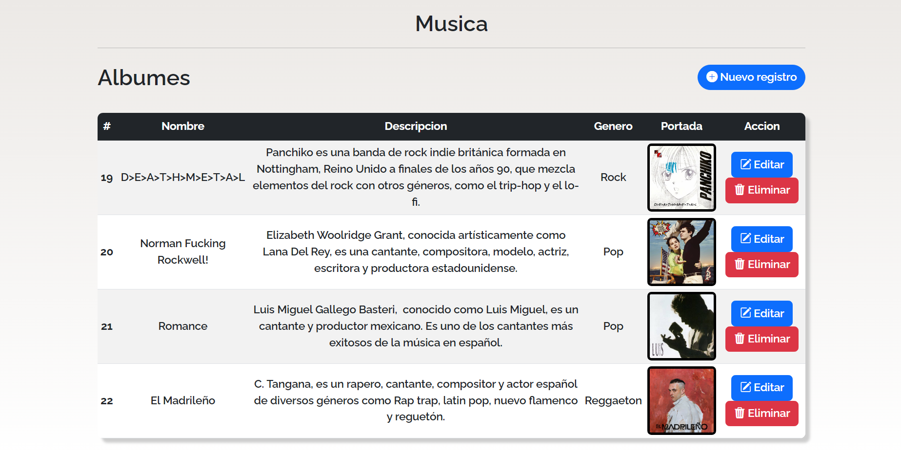
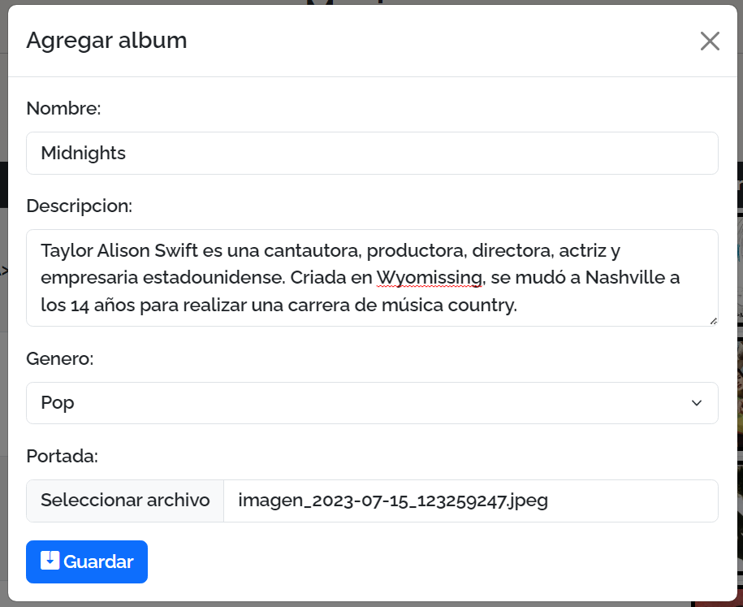
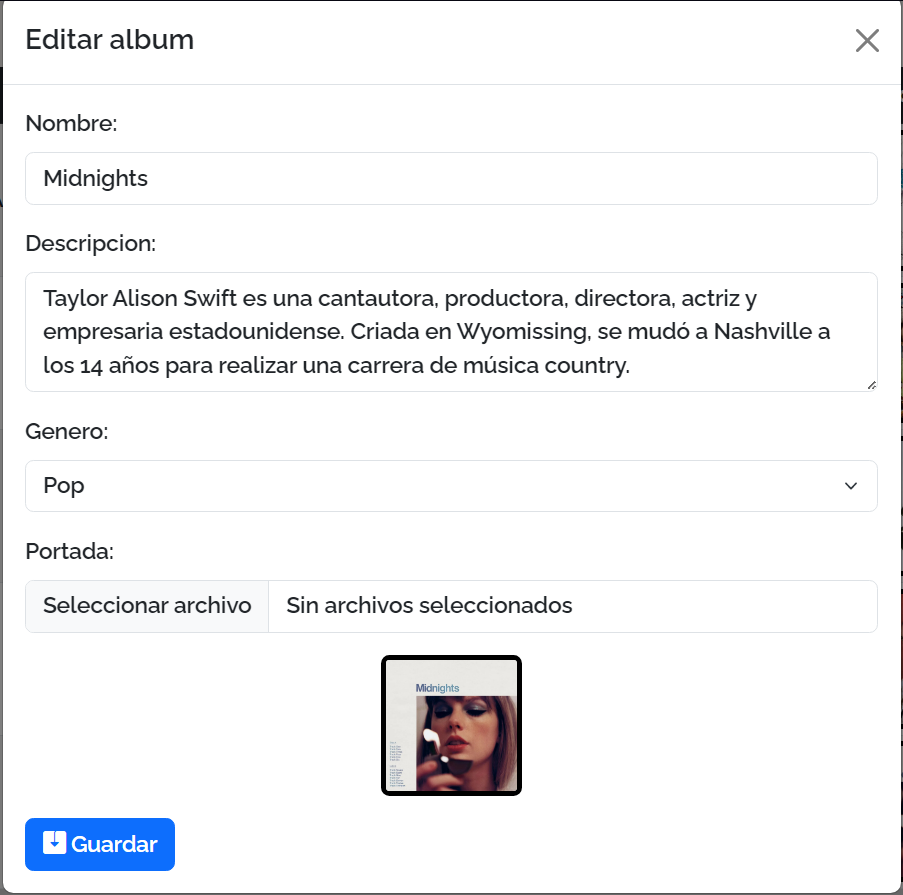
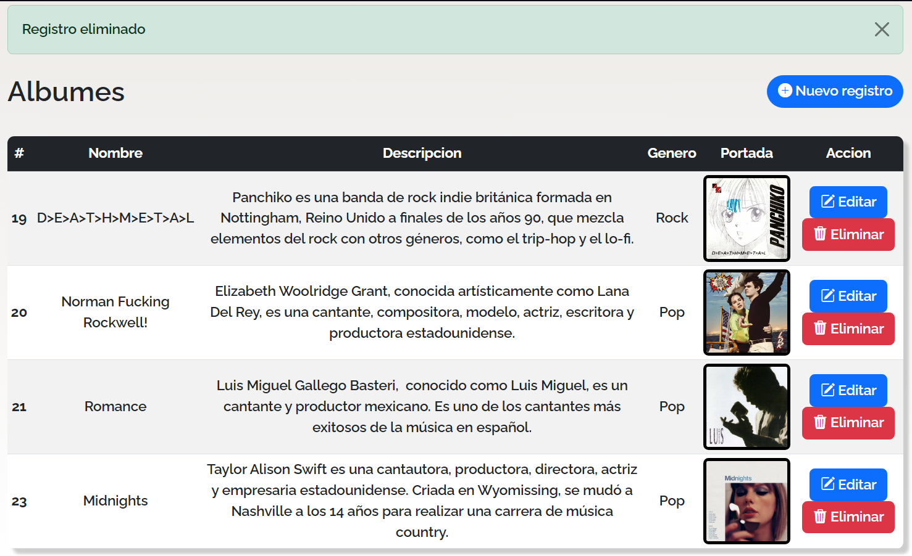

# Modal CRUD

Simple CRUD about Albums using modal dialogs

## Tech Stack 🎯

* PHP
* MySQL
* XAMPP
* Bootstrap  

## How to use it? 🔧

1. Download the project and move it to the htdocs folder
2. Start Apache and MySQL on your XAMPP application
3. Import the data base (music) `config/music.sql`
4. If necessary, change the access data of `config/database.php`  

## Screenshots 📌

### View albums

### Adding album

### Editing album

### After delete album

  

## Important 🔴  

* The images are not saved in the database, they are saved in the folder `music/covers/` 
* The names of the images are changed by the id number
* The DataBase has two tables (genre and music) which are related by a foreign key
* If you want to add more genres, you will have to do it through the database
* There may be some bugs that I didn't fix

 

